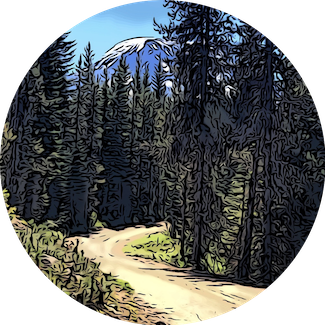

## Activity planning and analysis



### Activity
* [Cycling Analytics](https://www.cyclinganalytics.com/)
* [Ride with GPS](https://ridewithgps.com)
* [Strava](https://strava.com)
* [WTA](https://wta.org)

### Geo
* [GNIS](https://geonames.usgs.gov)
* [SRTM](https://github.com/sakisds/go-srtm)

### Weather
* [NOAA](https://weather.gov)
* [OpenWeather API](https://openweathermap.org/api)
* [VisualCrossing](https://visualcrossing.com)

### Examples

```sh
$ gravl strava export 4612178259
2021-01-12T20:22:13-08:00 INF export activityID=4612178259 format=original
"Innsbruck.fit"
$ gravl ca upload -f Innsbruck.fit
2021-01-12T20:23:12-08:00 INF uploading file=Innsbruck.fit size=112732
{
 "status": "processing",
 "ride_id": 0,
 "user_id": 1603533,
 "format": "fit",
 "datetime": "2021-01-13T04:23:15",
 "upload_id": 4775060590,
 "filename": "Innsbruck.fit",
 "size": 112732,
 "error": "",
 "error_code": ""
}
{
 "status": "done",
 "ride_id": 382207409453,
 "user_id": 1603533,
 "format": "fit",
 "datetime": "2021-01-13T04:23:15",
 "upload_id": 4775060590,
 "filename": "Innsbruck.fit",
 "size": 112732,
 "error": "",
 "error_code": ""
}
```
